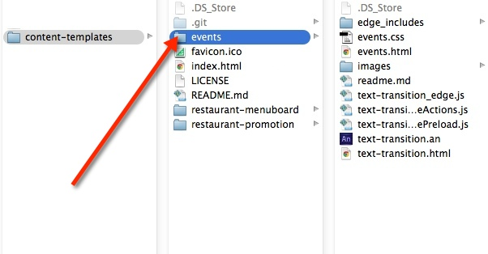
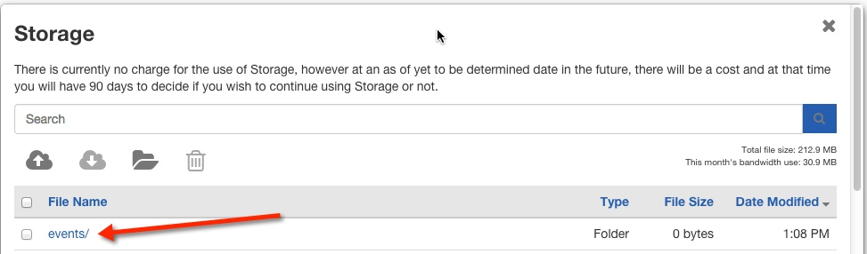

# Events Template 

## Introduction

The Events Template was created to display a series of custom events that rotate into the screen view one at a time. It can be modified to accommodate various markets and segments. A preview of the template can be seen here: http://commondatastorage.googleapis.com/risemedialibrary-395c64e5-2930-460b-881e-009aabb157df/content-templates/events/events.html

##Steps to run the events template:##

1. Fork or download the entire content-templates repository.


2. Modify the files within the events folder directory to fit your needs (see below on how to modify specific elements).


3. Host the entire “events” folder directory in rise vision storage or your web hosting service.


4. Copy the link to the events.html file where you have it hosted and insert the url into a schedule. (you can also add this link to the url gadget within a presentation)


##Directions to modify the events template:##

####Changing the animated background
Open events.html, locate the following code and modify the src url of the img tag to the path of your new background:

```<div id="background">

</div>```

The zooming and panning are created using css keyframes and transforms and can be changed in events.css style sheet by modifying the #background img ID.
 
####Changing the header text
 In events.html, locate the following tag and modify the text between the div tags:

```<div id="title">UPCOMING EVENTS</div>```

CSS and media queries are utilized to change the font size and styling depending on the display resolution which can be changed inside events.css style sheet by modifying the #title ID.

####Changing the slide text
The slide text is displayed through the use of the google-sheets web component. The example spreadsheet is located at https://docs.google.com/a/cameroncodes.com/spreadsheets/d/1WwSkJbyIH4EgVDni9eI65zK95MBv0R5c6JSVXsGEPiE/edit#gid=0

You can use your own public spreadsheet by locating the following code in the events.html file:

```<google-sheets id="sheet" 
               key="1WwSkJbyIH4EgVDni9eI65zK95MBv0R5c6JSVXsGEPiE"
               gid="0"
               rows="{{rows}}"
               published>
</google-sheets>```

The key for your spreadsheet can be found when viewing the document online, as can be seen in the example above. 

In order to view a private spreadsheet, you will need to obtain an ID from https://console.developers.google.com. This is optional if accessing a public spreadsheet, and is currently set to 'sheet' in the above example.

You can then edit the text within the cells of the spreadsheet and the changes will appear in the display.

####Changing the text transition
The events text transition was built with css keyframes animation.  To modify, open the events.css file and locate the keyframes animation code for the slides beginning:

```@-webkit-keyframes "slide1Animation"```

You can make changes to the timing of the slide animations by changing the percentage of the keyframes, as well as position and opacity. 

General animation controls for the duration of the animation as well as the easing can be changed for each individual slide by locating the following code:

```-webkit-animation: slide1Animation 30s ease-in-out infinite;```

In the above line of code, '30s' refers to the total time of the animation, 'ease-in-out' is the style of transition, and 'infinite' allows the animation to run continuously.

####Changing the logo
In events.html, locate the following code and modify the src url of the img tag to the path of your new logo:

```<div  id="logo">
    	
    </div>```

## Built With
actual tools used
- HTML
- CSS
- Java Script
- Google-Sheets
- Polymer
- Bower

Events Template works in conjunction with [Rise Vision](http://www.risevision.com), the [digital signage management application](http://rva.risevision.com/) that runs on [Google Cloud](https://cloud.google.com).

At this time Chrome is the only browser that this project and Rise Vision supports.

## Submitting Issues
If you encounter problems or find defects we really want to hear about them. If you could take the time to add them as issues to this Repository it would be most appreciated. Please Identify the specific template that has the issue and follow the following format where applicable:

**Reproduction Steps**

1. did this
2. then that
3. followed by this (screenshots / video captures always help)

**Expected Results**

What you expected to happen.

**Actual Results**

What actually happened. (screenshots / video captures always help)

## Contributing
All contributions are greatly appreciated and welcome! If you would first like to sound out your contribution ideas please post your thoughts to our [community](http://community.risevision.com), otherwise submit a pull request and we will do our best to incorporate it.

### Suggested Contributions
- Alternative ways to animate background
- Alternative ways to animate text transitions
- Dynamically update events from custom data source
- i18n Language Support

## Resources
If you have any questions or problems please don't hesitate to join our lively and responsive community at http://community.risevision.com.

If you are looking for user documentation on Rise Vision please see http://www.risevision.com/help/users/

If you would like more information on developing applications for Rise Vision please visit http://www.risevision.com/help/developers/.

 If you have any questions or problems please don't hesitate to join our lively and responsive community at http://community.risevision.com.
 
**Additional Content Templates can be found here: https://github.com/Rise-Vision/content-templates**

**Facilitator**

[Mathew Meiers](https://github.com/mmeiers "Mathew Meiers")
